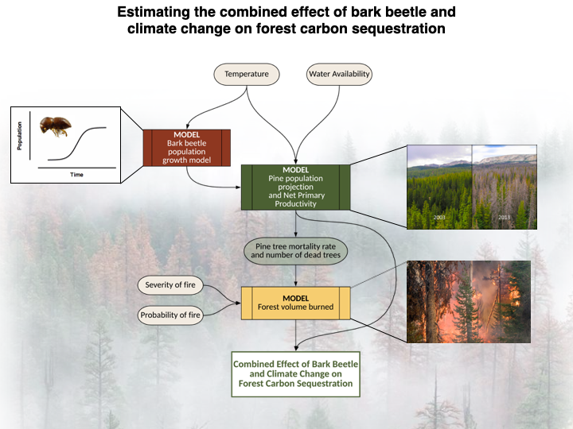

```{r setup, include=FALSE}
knitr::opts_chunk$set(echo = TRUE)
```
###########################
#Just adding in the assigment description. Let's delete when we're done.
1. Identify a question for which the use of a model would help you to answer it. Select a question that has the following characteristics. The model should involve at least 3 sub models:
 a. It would be interesting to perform sensitivity analysis for at least two parameters
 
 b. At least one sub-model should include either an ODE or a spatial model
 
 c. Provide some rationale for why this is an important question to answer and why a model is needed (1-2 paragraphs)

2. Develop a conceptual model of your approach
 a. Identify the characteristics of submodels that you will use - spatial or lumped, dynamic or static, deterministic or stochastic, physically based/abstract?
 
 b. Identify the goal of your model  - what is the question that it will be used to answer; for which types of users
 
 **c. Design a figure to illustrate your conceptual model
 
 d. Determine the inputs, outputs that will be used for each submodes

You will complete a draft version of I and II and submit as an Rmarkdown document or text file by May 1.
#############################

### Overarching Question: 
- How will climate change impacts on bark beetle populations and tree populations influence forest carbon sequestration?

- Approach: This larger model relies on three submodels: 1) a bark beetle population growth model, 2) a tree population projection model, and 3) tree volume burned. 

- Expectations: We expect temperature changes to influence the success of both populations. Water availability has been show to be influential in tree defense from bark beetles. Carbon sequestration will incorporate the volume of dead trees and forest NPP to provide information about how much carbon is sequestered in the forest following a fire. 

- Extra component: The probility of fire and the fire's severity will be a user controlled input. Three fire severity levels will be pre-defined and selected by the user (high, medium, and low).

###Rationale for Model Importance:
INSERT 1-2 paragraphs here...


##Beginning Model Inputs: 
### 1. Bark beetle population growth model
* Lumped
* Static (Will potentially make dynamic to then also make the pine model more dynamic)
* Deterministic
* Physically-based
* Will include an ODE

```{r bark_beetle}
# Data input examples
N_0=10000 # Initial population size
r=0.75 # Intrinsic growth rate
K=100000 # Carrying capacity

# Model -- Logistic growth model. Once we've chosen a particular beetle and tree species, we hope to find a published growth model. 
```

### 2. Pine population projection model
* Lumped
* Static
* Hopefully stochastic, dependent on available information
* Physically-based
```{r pine_projection_model}
# Data input examples
# Stage


```

### 3. Model of forest volume burned
* Lumped
* Static
* Deterministic
* Physically-based
```{r forest_burned}


```


**c. Design a figure to illustrate your conceptual model**

<center>


